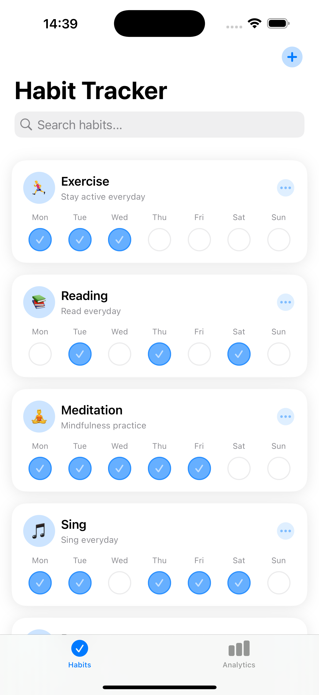
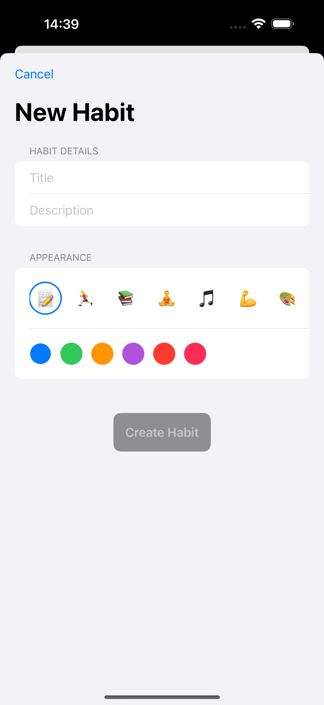
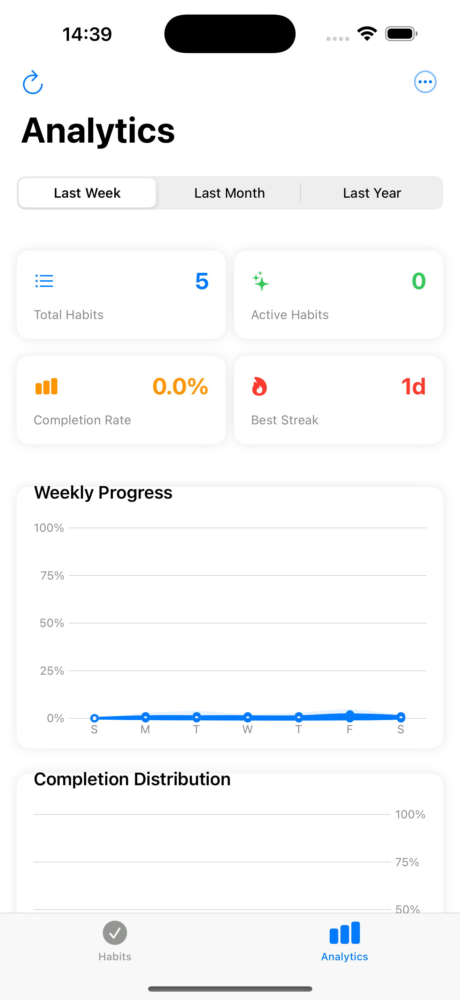
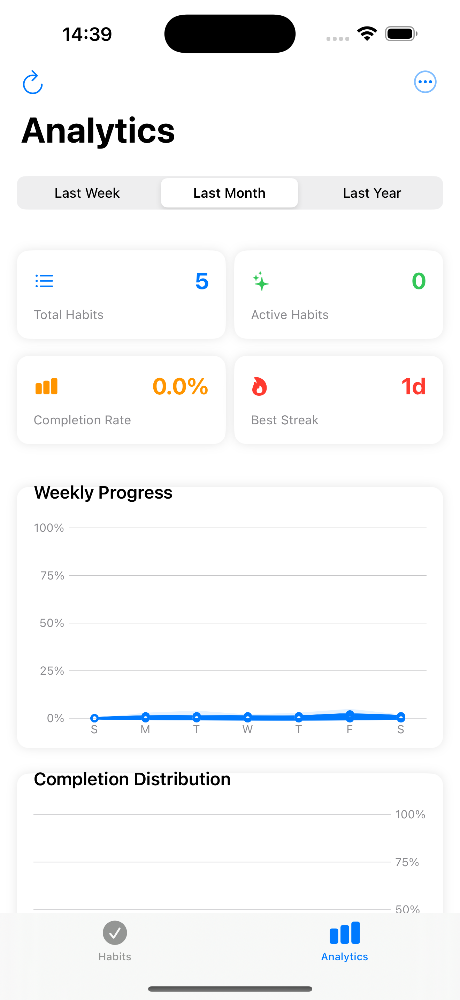

# TrackioApp

A modern iOS habit tracking application built with SwiftUI that helps users build and maintain healthy habits through intuitive tracking and detailed analytics.



## Features

### 🎯 Habit Management
- **Create, edit, and delete habits** - Easily add new habits with customizable titles and descriptions
- **Customize with emojis and colors** - Make your habits visually distinct and personal
- **Weekly tracking system** - Track completions for each day of the week with interactive checkmarks
- **Streak counting** - Monitor your current streaks to stay motivated



### 📊 Analytics Dashboard
- **Multiple time period analysis** - View your data across different time frames (week, month, year)
- **Visual completion rate tracking** - See your overall completion percentage at a glance
- **Habit performance metrics** - Track total habits, active habits, completion rates, and best streaks
- **Interactive charts** - Weekly progress and completion distribution visualizations

<div style="display: flex; justify-content: space-between;">
  
  
  
</div>

### 📱 User Experience
- **Clean, modern interface** - Intuitive design focused on ease of use
- **Haptic feedback** - Tactile responses for a more engaging experience
- **Dark mode support** - Automatically adapts to system appearance settings
- **Smooth animations** - Polished interactions throughout the app

### 💾 Data Management
- **Local data persistence** - Your habits are automatically saved on your device
- **Data export functionality** - Export your data in CSV or JSON formats
- **Analytics sharing** - Share your habit stats with friends or accountability partners

## Technical Details

### Requirements
- iOS 16.0+
- Xcode 15.0+
- Swift 5.9+

### Architecture
- **MVVM architecture** - Clean separation of data, logic, and UI
- **SwiftUI** - Modern declarative UI framework for all components
- **Combine** - Reactive programming for data flow
- **Charts** - Native visualization framework for analytics
- **UserDefaults** - Local storage for habit persistence

### Key Components
- `HabitStore`: Core data management for habits
- `DashboardViewModel`: Analytics processing and metrics calculation
- `NotificationManager`: Push notification handling for reminders
- `DataExportManager`: Data export functionality (CSV/JSON)

## Installation

1. Clone the repository:
```bash
git clone https://github.com/yourusername/TrackioApp.git
```

2. Open `TrackioApp.xcodeproj` in Xcode

3. Build and run the project on your iOS device or simulator

## Usage Tips

### Creating a New Habit
1. Tap the "+" button in the top right corner
2. Enter a title and optional description
3. Choose an emoji and color
4. Tap "Create Habit" to add it to your list

### Tracking Habits
- Tap the circle for any day to mark a habit as completed
- The app automatically calculates your streaks and completion rates
- View detailed analytics by switching to the Analytics tab

### Exporting Data
1. Navigate to the Analytics screen
2. Tap the menu button (three dots) in the top right
3. Select "Export Data"
4. Choose your preferred format (CSV or JSON)

## Privacy & Security

TrackioApp respects your privacy:
- All data is stored locally on your device
- No data is transmitted to external servers
- No analytics or tracking code is included

## Author

Ismat Samadov

## License

This project is available as open source under the terms of the MIT License.